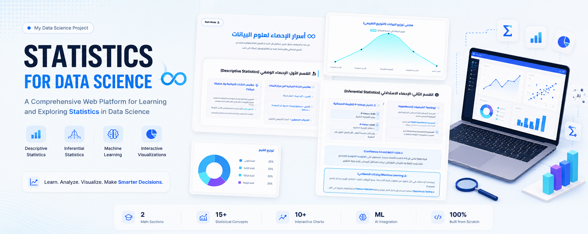

# 📊 Introduction to Statistics for Data Science

An interactive educational web application designed to simplify the fundamentals of statistics for Data Science and Machine Learning through modern visualizations, practical examples, and intuitive explanations.

This project transforms complex statistical concepts into an engaging learning experience using interactive charts, responsive UI components, and beginner-friendly explanations.

---

## ✨ Features

* Comprehensive introduction to Descriptive Statistics.
* Interactive explanation of Inferential Statistics.
* Practical examples for Data Science applications.
* Dynamic data visualizations powered by Chart.js.
* Dark & Light mode support.
* Modern responsive interface.
* Glassmorphism-inspired UI design.
* Arabic-first educational experience.
* Machine Learning insights connecting statistical concepts with real-world AI workflows.

---

## 📚 Topics Covered

### Descriptive Statistics

* Mean
* Median
* Mode
* Range
* Variance
* Standard Deviation
* Data Distribution

### Inferential Statistics

* Population vs Sample
* Hypothesis Testing
* Null & Alternative Hypothesis
* P-Value
* Confidence Intervals
* Statistical Significance

### Data Science Applications

* Missing Value Handling
* Feature Scaling
* Feature Selection
* Machine Learning Data Preparation
* Statistical Decision Making

---

## 🛠 Technologies

* HTML5
* CSS3
* JavaScript
* Chart.js
* Font Awesome
* Google Fonts

---

## 🎯 Purpose

This project was built to provide students and beginners with an interactive introduction to statistical concepts required for Data Science and Machine Learning.

Instead of presenting statistics as isolated mathematical formulas, the application explains each concept visually and demonstrates its practical relevance in modern AI systems.

---

## 📱 Highlights

* Interactive Learning Experience
* Responsive Design
* Educational Visualizations
* Performance Optimized
* Beginner-Friendly Explanations
* Modern UI/UX

---

## 👨‍💻 Author

Designed and developed by **Mohamed Soliman**

Software Engineer • Cybersecurity Student

---

## ⚠️ Intellectual Property Notice

This project is an original educational work created and owned by **Mohamed Soliman**.

The source code, educational content, UI/UX design, visual identity, illustrations, documentation, and project structure are provided for portfolio and demonstration purposes only.

Unauthorized copying, redistribution, modification, commercial use, or reproduction of any part of this project is prohibited without prior written permission.

© 2026 Mohamed Soliman. All Rights Reserved.
